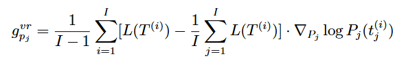
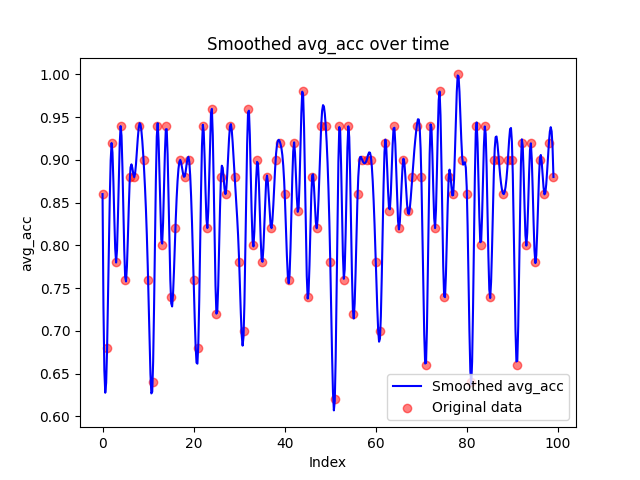
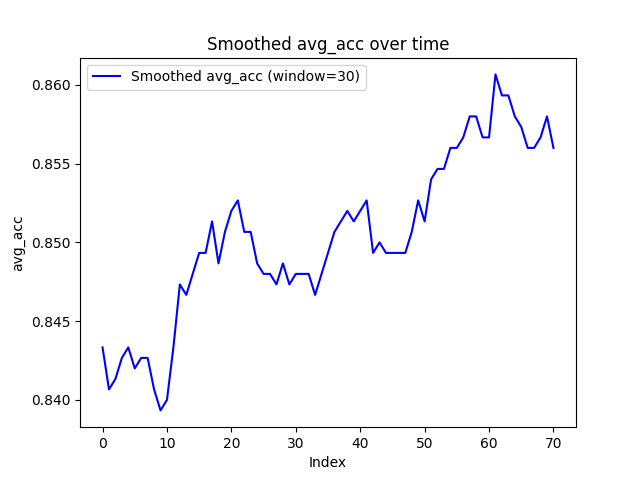
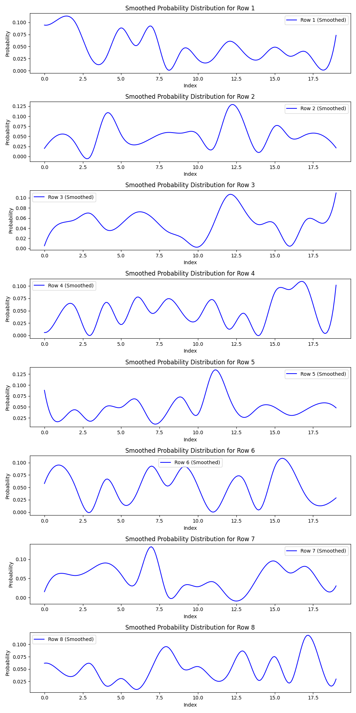
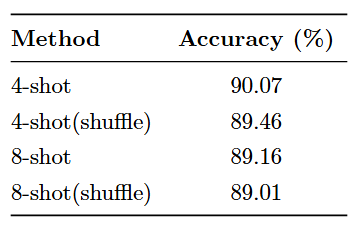
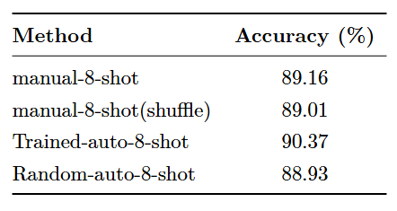

# Reproduce Automate-CoT

## Generate the dataset
In `./datasets/preprocess_gsm8k.py` we prepare the exemplar pool(knowledge dataset), train and test datasets.
```shell
cd ./datasets
python preprocess_gsm8k.py --pool --pool_size 20
```
### Construct the exemplar pool
- config: `--pool --pool_size <your desired pool size>`
- We use deepseek-chat to generate the response, and select the answer that matches the gound truth. 
- The knowledge dataset is shown in `./datasets/gsm8k_/deepseek/gsm8k_pool_20.json`
### Prepare the train and test dataset 
- config: `--train --train_size <your desired train size>``--test --test_size <your desired test size>`
- They are selected from GSM8K dataset. We set the range of index for selection to avoid the overlap.
- We need these dataset to train the policy to select the exemplars for final prompt.
### Dataset Format
```
    [
    {
        "id": "1",
        "Question": "Natalia sold clips to 48 of her friends in April, and then she sold half as many clips in May. How many clips did Natalia sell altogether in April and May?",
        "Rationale": " She sold 48 clips in April. In May she sold half as many, so she sold 48 / 2 = 24 clips. In total she sold 48 + 24 = 72 clips",
        "Answer": "The answer is 72.",
        "Ground_truth": "72"
    },
    ...
    ]
```

## Train the exemplar selection policy
In `./src/example_selection.py` we train a policy that selects exemplars from knowledge dataset to construct the final prompt.
```shell
python ./src/train_example_selection.py 
```
- The trained policy is a matrix of probability whose dimension is `sample_size * pool_size`. Exemplar at each position of the final prompt is sampled independently from its own distribution over the exemplar pool.
- We use variation-reduced policy gradient estimator to optimize our policy.
  - We use the accuracy on training dataset as environmental response to a constructed prompt.
  - To reduce the variance, the update scale for each prompt is derived by the difference of its accuracy and the average level.
  <figure style="text-align: center;">
    
    <figcaption>VR-PGE gradient</figcaption>
  </figure>
  
  - In detail, we sample `pge_avg_samples` prompts and evaluate their performance on the training dataset. Then, we use their accuracy to calculate an average level and the gradient.

<figure style="text-align: center;">
    
    <figcaption>Training curve</figcaption>
</figure>
<figure style="text-align: center;">
    
    <figcaption>Training curve smoothed</figcaption>
</figure>

<figure style="text-align: center;">
    
    <figcaption>Final policy</figcaption>
</figure>

## Experiments
We sample the prompt from the final policy and test its performence on GSM8K. The script for evaluation by opencompass is in `./gsm8k_prompts`. The results of evaluation is in `./experiments`.

### Do permutations influence the performance?
This work was originally implemented with davinci-002. As the LLM has updated innumerable versions and has been making a great progress, we wonder whether the style, permutations of the prompt, as well as other factors mentioned by the author, still influence the performance.

We randomly shuffle the permutations of the exemplars in few-shot prompts. The evaluation results show that the permutations still slightly influence the performence.

<figure style="text-align: center;">
    
    <figcaption>Permute the exemplars and check the performance.</figcaption>
</figure>

### Does the training process work?
We train the policy based on the accuracy response from the training dataset. Intuitively, after training process, the sampled prompt should be in a form that LLM favored and lead to higher accuracy.

We generate the prompt from the policy and compare it with randomly sampled exemplars as well as the manually written prompt. The results show that our method do improve the quality of the prompt. Note that the prompt constructed by randomly selected exemplars from the exemplar pool performs worse than manual prompt, while the prompt constructed by the exemplars sampled from trained policy performs better than it.
<figure style="text-align: center;">
    
    <figcaption>The performance of manual CoT prompt, trained auto prompt and randomly sampled auto prompt.</figcaption>
</figure>

```
# few-shot-4 90.07
python run.py --models deepseek_api.py --datasets gsm8k_gen_few_shot.py --debug 
# few-shot-4 shuffle 89.46
python run.py --models deepseek_api.py --datasets gsm8k_gen_few_shot_shuffle.py --debug 
# few-shot-8 89.16
python run.py --models deepseek_api.py --datasets gsm8k_gen_few_shot_8.py --debug 
# few-shot-8 shuffle 89.01
python run.py --models deepseek_api.py --datasets gsm8k_gen_few_shot_8_shuffle.py --debug 
# few-shot-8 generated default 90.30
python run.py --models deepseek_api.py --datasets gsm8k_gen_few_shot_generated_default.py --debug 
# few-shot-8 generated epoch10 lr1e-2  90.37
python run.py --models deepseek_api.py --datasets gsm8k_gen_few_shot_generated_epoch10_lr_1e-2.py --debug 
# few-shot-8 randomly sample from example pool 88.93
python run.py --models deepseek_api.py --datasets gsm8k_gen_few_shot_8_random_sample.py --debug 
```